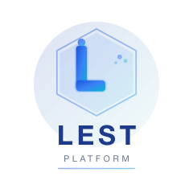

<p align="center">
  
</p>

<h1 align="center">LEST Platform</h1>

<p align="center">
  面向现代工程团队的开源云原生项目管理平台
</p>

<p align="center">

<!-- Badges row 1 -->
<a href="https://github.com/lest-work/lest/releases/latest"></a>
<a href="https://github.com/lest-work/lest/blob/main/LICENSE"></a>
<a href="https://github.com/lest-work/lest/actions/workflows/ci.yml"></a>
<a href="https://github.com/lest-work/lest/issues"></a>
<a href="https://github.com/lest-work/lest/stargazers"></a>
<a href="https://github.com/lest-work/lest/fork"></a>

<!-- Badges row 2 -->
<a href="https://www.oracle.com/java/technologies/downloads/#java21"></a>
<a href="https://spring.io/projects/spring-boot"></a>
<a href="https://v3.vuejs.org"></a>
<a href="https://nestjs.com"></a>
<a href="https://docker.com"></a>
<a href="https://github.com/lest-work/lest/discussions"></a>
</p>

<p align="center">
  <a href="README.md"></a>
  <a href="https://github.com/lest-work/lest/releases"></a>
  <a href="https://github.com/lest-work/lest/discussions"></a>
  <a href="https://github.com/lest-work/lest/issues/new/choose"></a>
</p>

---

## 📖 项目简介

**LEST Platform** 是一款面向软件工程团队的全功能云原生项目与任务管理平台，提供项目全生命周期管理、迭代规划、任务跟踪、工时记录、发布管理和团队协作的一体化解决方案。

后端架构深度参考了经过大规模生产验证的 [RuoYi-Cloud](https://ruoyi.vip) 微服务框架，前端管理界面基于 [EleAdmin Pro](https://eleadmin.com) 这一优秀的 Vue 3 组件库构建。

> **关于许可证** — 本项目所依赖的核心框架均提供官方商业授权。如果您在商业产品中使用 RuoYi，建议前往 [ruoyi.vip](https://ruoyi.vip) 购买官方授权或赞助作者。如果您在生产项目中使用 EleAdmin Pro，请前往 [eleadmin.com](https://eleadmin.com) 购买正版商业授权，这是对开发者劳动的尊重，也是对持续开发的直接支持。

---

## ✨ 功能特性

| 模块 | 功能亮点 |
|------|---------|
| **认证服务** | 图形验证码登录、JWT Token 签发与刷新、Redis Session 管理 |
| **系统管理** | 用户 / 角色 / 菜单 / 部门 / 岗位 / 字典 / 参数 / 公告 |
| **审计日志** | 操作日志、登录日志、在线用户管理、强制退出 |
| **定时任务** | 基于 Quartz 的任务调度，含执行历史记录 |
| **项目管理** | 项目 CRUD、归档、成员管理、模板支持（敏捷 / 看板 / 瀑布流） |
| **迭代管理** | 迭代规划、状态生命周期、里程碑时间线 |
| **任务管理** | 任务增删改查、优先级与类型标签、子任务、指派、截止日期 |
| **任务看板** | 三列看板（待办 / 进行中 / 已完成），按项目和迭代过滤 |
| **工时记录** | 任务粒度工时录入，支持预估工时 vs 实际工时对比 |
| **文件服务** | 文件上传/下载，基于 MinIO 对象存储 |
| **仪表盘** | 实时动态流、成员在线状态、项目进度卡片 |

---

## 🏗️ 架构设计

```
                ┌──────────────────────────────────┐
                │        Nginx / 前端               │
                │   Vue 3 + TypeScript + EleAdmin   │
                └────────────────┬─────────────────┘
                                 │ HTTP /api/*
                ┌────────────────▼─────────────────┐
                │       API 网关 [8080]              │
                │   Spring Cloud Gateway + JWT 鉴权  │
                └──┬────┬────┬────┬────┬────┬──────┘
                   │    │    │    │    │    │
        ┌──────────▼─┐ ┌▼──┐ ┌▼──┐ ┌▼──┐ ┌▼──┐  ┌──────┐
        │ lest-auth  │ │sys│ │prj│ │tsk│ │job│  │ ...  │
        │  [8096]    │ │81 │ │82 │ │83 │ │93 │  │      │
        └────────────┘ └───┘ └───┘ └───┘ └───┘  └──────┘
                   │    │    │    │    │
        ┌──────────▼────▼────▼────▼────▼──────────────┐
        │     Nacos（服务注册 + 配置中心）               │
        │     MySQL 8  ·  Redis 7  ·  Kafka            │
        │     MinIO  ·  Sentinel                       │
        └───────────────────────────────────────────────┘
```

---

## 🛠️ 技术栈

| 层级 | 技术选型 |
|------|---------|
| **后端框架** | Spring Boot `4.0.3` + Spring Cloud `2025.1.0` + Spring Cloud Alibaba `2025.1.0.0` |
| **数据库 ORM** | 原生 MyBatis + PageHelper（无 Lombok，手写 getter/setter） |
| **安全认证** | Spring Security + JWT（jjwt `0.12.7`） |
| **服务注册** | Nacos v2.x |
| **缓存** | Redis 7 + Spring Cache |
| **消息队列** | Apache Kafka |
| **对象存储** | MinIO |
| **定时调度** | Quartz |
| **前端** | Vue 3 + TypeScript + Element Plus + Vite |
| **UI 组件库** | [EleAdmin Pro](https://eleadmin.com) |
| **构建工具** | Maven 3.9+（多模块扁平化架构） |
| **容器化** | Docker + Docker Compose |

---

## 📦 模块结构

```
lest-platform/
├── backend/                    # Java 后端（Maven 多模块）
│   ├── lest-common/            # 公共库（core/security/log/redis/...）
│   ├── lest-auth/              # 认证服务                 [8096]
│   ├── lest-gateway/           # API 网关                 [8080]
│   ├── lest-api/               # Feign 客户端接口
│   └── lest-modules/
│       ├── lest-system/        # 系统管理                 [8081]
│       ├── lest-project/       # 项目管理                 [8082]
│       ├── lest-task/          # 任务管理                 [8083]
│       ├── lest-release/       # 发布管理                 [8087]
│       ├── lest-job/           # 定时任务                 [8093]
│       └── lest-file/          # 文件服务                 [8091]
├── frontend-pc/                # 管理端 Web（Vue 3 + TS）
├── frontend-h5/                # 移动端 H5
├── frontend-app/               # 原生移动 App
└── docs/                       # 架构、API、PRD、任务文档
```

---

## 🚀 快速启动

### 前提条件

| 依赖 | 最低版本 |
|------|---------|
| JDK | 21 |
| Maven | 3.9 |
| Docker | 24.x |
| Docker Compose | 2.x |
| Node.js | 18+ |

### 方式一 — Docker Compose（推荐）

```bash
# 克隆仓库
git clone https://github.com/lest-work/lest.git
cd lest-platform

# 启动所有基础设施 + 服务
docker compose -f backend/docker/docker-compose.local.yaml up -d

# 启动前端开发服务器（热更新）
cd frontend-pc
npm install
npm run dev
```

### 方式二 — 本地开发

```bash
# 1. 启动基础设施（MySQL、Redis、Nacos）
docker compose -f backend/docker/docker-compose.local.yaml up mysql redis nacos -d

# 2. 构建后端
cd backend
mvn clean install -DskipTests

# 3. 分别启动各服务（各开一个终端）
详见 backend/docker/README.md
./bin/run-gateway.sh
./bin/run-system.sh

# 4. 启动前端
cd ../frontend-pc
npm run dev
```

---

## 🌐 访问地址

### 本地开发

本地开发时，Vite 开发服务器会将 `/api/*` 请求代理到 `localhost:8080` —— **无需配置域名或 hosts 文件**。

| 服务 | 本地地址 | 账号密码 |
|------|---------|---------|
| **前端** | http://localhost:5173 | admin / admin123 |
| **API 网关** | http://localhost:8080 | — |
| **API 文档** | http://localhost:8080/doc.html | — |
| **Nacos 控制台** | http://localhost:8848/nacos | nacos / nacos |
| **MinIO 控制台** | http://localhost:9001 | minioadmin / minioadmin |

### 生产环境

> 以下服务托管于 `lest.work` 域名。完整域名架构见 [docs/guide/DOMAIN_PLAN.md](./docs/guide/DOMAIN_PLAN.md)。

| 服务 | 生产环境地址 | 账号密码 |
|------|------------|---------|
| **Web 应用** | https://app.lest.work | admin / admin123 |
| **API 网关** | https://api.lest.work | — |
| **API 文档** | https://doc.lest.work | — |
| **Nacos 控制台** | https://nacos.lest.work | nacos / nacos |
| **MinIO 控制台** | https://minio.lest.work | minioadmin / minioadmin |

> **官网** — 访问 [https://lest.top](https://lest.top) 了解产品介绍。

---

## 📋 版本规划

> 追踪项目进度。详细里程碑见 [docs/MILESTONES.zh-CN.md](./docs/MILESTONES.zh-CN.md)。

```
v0.1.0          v0.2.0          v0.3.0          v0.4.0          v0.5.0          v1.0.0
  |               |               |               |               |               |
  ●───────────────●───────────────○               ○               ○               ○  基础框架
  ●───────────────●───────────────○               ○               ○               ○  认证服务
  ●───────────────●───────────────○               ○               ○               ○  系统管理
  ●───────────────●───────────────○               ○               ○               ○  API 网关
  ●───────────────●───────────────○               ○               ○               ○  项目后端
  ●───────────────●───────────────○               ○               ○               ○  任务后端
  ○───────────────●───────────────○               ○               ○               ○  项目前端
  ○───────────────●───────────────○               ○               ○               ○  任务前端
  ○───────────────●───────────────○               ○               ○               ○  发布后端
  ○───────────────○───────────────●               ○               ○               ○  燃尽图
  ○───────────────○───────────────●               ○               ○               ○  看板拖拽
  ○───────────────○───────────────●               ○               ○               ○  工时/评论
  ○───────────────○───────────────○               ●               ○               ○  通知服务
  ○───────────────○───────────────○               ●               ○               ○  会议管理
  ○───────────────○───────────────○               ●               ○               ○  发布前端
  ○───────────────○───────────────○               ○               ●               ○  CI 集成
  ○───────────────○───────────────○               ○               ●               ○  WakaTime
  ○───────────────○───────────────○               ○               ●               ○  效能看板
  ○───────────────○───────────────○               ○               ○               ●  AI 助手
  ○───────────────○───────────────○               ○               ○               ●  移动端
  ○───────────────○───────────────○               ○               ○               ●  插件系统

  ✅ 已发布        ✅ 已发布        🔵 计划中      🔵 计划中      🔵 计划中      🔵 计划中
```

| 版本 | 主题 | 目标日期 | 状态 |
|------|------|---------|------|
| **v0.1.0** | 基础框架 — 认证、系统管理、网关、仪表盘 | 2026-05-29 | ✅ 已发布 |
| **v0.2.0** | 项目与任务前端页面、DDL、API 补全 | 2026-05-30 | ✅ 已发布 |
| **v0.3.0** | 燃尽图、看板拖拽、任务工时/评论面板 | 2026-06-05 | 🔵 计划中 |
| **v0.4.0** | 通知服务（WebSocket）、会议管理、发布前端 | 2026-06-12 | 🔵 计划中 |
| **v0.5.0** | CI 集成、WakaTime、效能数据看板 | 2026-06-19 | 🔵 计划中 |
| **v0.6.0–v0.9.0** | 高级模块 — AI、插件、开放平台 | 2026-07 | 🔵 计划中 |
| **v1.0.0** | 正式版 — 全功能集、移动端、完整文档 | 2026-08-07 | 🔵 计划中 |

完整更新记录见 [CHANGELOG.zh-CN.md](./CHANGELOG.zh-CN.md)，里程碑规划见 [docs/MILESTONES.zh-CN.md](./docs/MILESTONES.zh-CN.md)。

---

## 🤝 参与贡献

欢迎贡献代码！提交前请阅读贡献指南。

| 资源 | 说明 |
|------|------|
| [CONTRIBUTING.md](./CONTRIBUTING.md) | 贡献指南、代码规范、提交规范 |
| [docs/guide/DEVELOPMENT.md](./docs/guide/DEVELOPMENT.md) | 开发指南（环境搭建、工程规范、代码规范） |
| [docs/reference/ARCHITECTURE.md](./docs/reference/ARCHITECTURE.md) | 系统架构设计（微服务、部署架构、服务通信） |
| [docs/reference/api/API.zh-CN.md](./docs/reference/api/API.zh-CN.md) | API 接口文档（中文） |
| [docs/guide/BRANCHING.md](./docs/guide/BRANCHING.md) | 分支命名、Git Flow 工作流、Commit 格式 |
| [CHANGELOG.zh-CN.md](./CHANGELOG.zh-CN.md) | 版本历史和版本号规范 |
| [docs/MILESTONES.zh-CN.md](./docs/MILESTONES.zh-CN.md) | 功能路线图和里程碑规划 |

### 快速开始

```bash
# 1. Fork 并克隆仓库
git clone https://github.com/YOUR_USERNAME/lest.git
cd lest-platform

# 2. 添加上游仓库
git remote add upstream https://github.com/lest-work/lest.git

# 3. 从 develop 创建功能分支
git checkout -b feature/your-feature-name

# 4. 提交代码（遵循 Conventional Commits）
git commit -m "feat(project): add burndown chart component"

# 5. 保持 Fork 与上游同步
git fetch upstream
git rebase upstream/develop

# 6. 推送并发起 Pull Request
git push origin feature/your-feature-name
```

> 完整指南包括编码标准、测试要求、PR 检查清单，见 [CONTRIBUTING.md](./CONTRIBUTING.md)。

---

## 🔒 安全问题

发现安全漏洞？请阅读 [SECURITY.md](./SECURITY.md) 了解负责任的披露流程。请勿公开提交安全问题。

---

## 🙏 致谢

本项目站在巨人的肩膀上，在此真诚感谢：

- **[RuoYi-Cloud](https://ruoyi.vip)** — LEST Platform 的后端微服务架构、安全框架、权限模型及代码生成规范深度参考了 RuoYi-Cloud。RuoYi 是中国开发者社区中最全面、最成熟的开源 Java 微服务脚手架之一，拥有庞大的用户群体和活跃的社区生态。**如果您在商业产品中使用了 RuoYi，请考虑前往 [ruoyi.vip](https://ruoyi.vip) 购买官方授权或向作者捐赠，支持优秀开源项目的持续发展。**

- **[EleAdmin Pro](https://eleadmin.com)** — LEST Platform 的前端管理界面基于 EleAdmin Pro 构建。EleAdmin Pro 是一款基于 Vue 3 + Element Plus 的高质量管理后台组件库，设计精良、体验出色、功能丰富。**如果您的项目中也采用了 EleAdmin Pro，我们强烈建议前往 [eleadmin.com](https://eleadmin.com) 购买官方商业授权，这是对作者原创设计和持续维护工作的认可与支持。**

- [Spring Boot](https://spring.io/projects/spring-boot) / [Spring Cloud Alibaba](https://github.com/alibaba/spring-cloud-alibaba) / [Vue 3](https://vuejs.org) / [Element Plus](https://element-plus.org) — 以及所有让本项目成为可能的开源依赖。

---

## 📄 许可证

本项目基于 **Apache License 2.0** 开源，详见 [LICENSE](./LICENSE) 文件。

> Apache License 2.0 仅适用于 LEST Platform 本身的源代码。请遵守各第三方依赖的独立许可协议，特别是上述致谢中涉及商业授权的组件。
